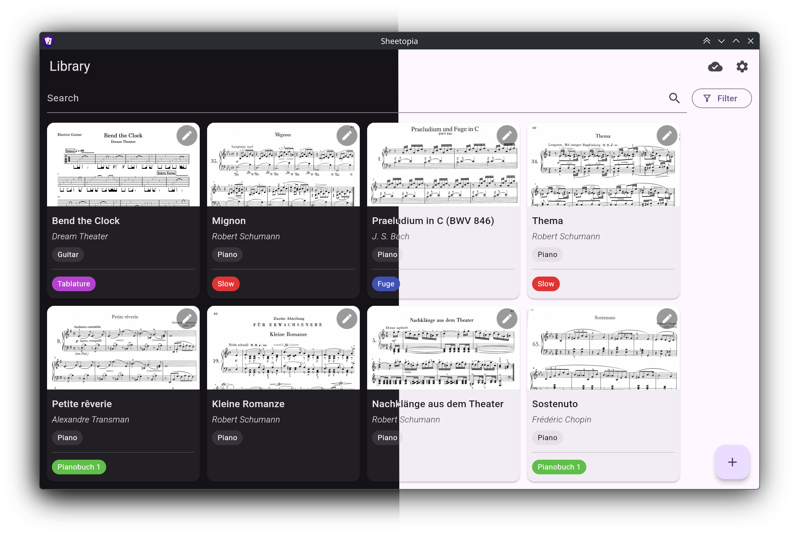
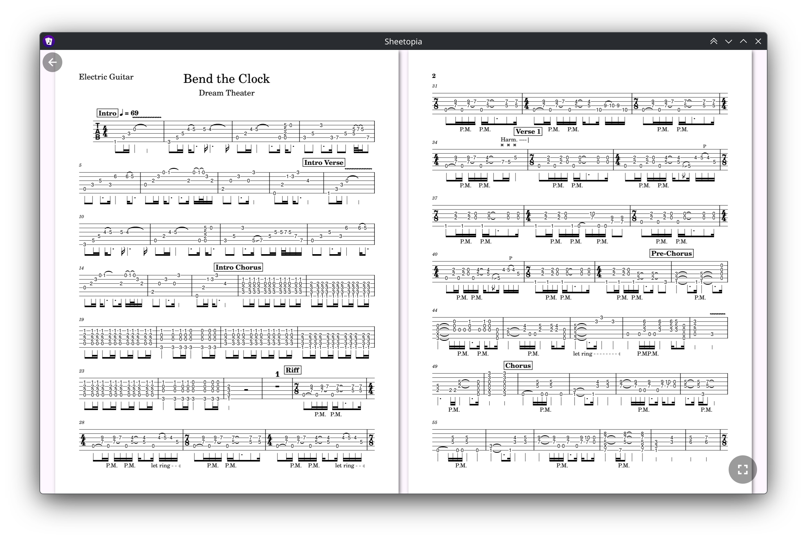
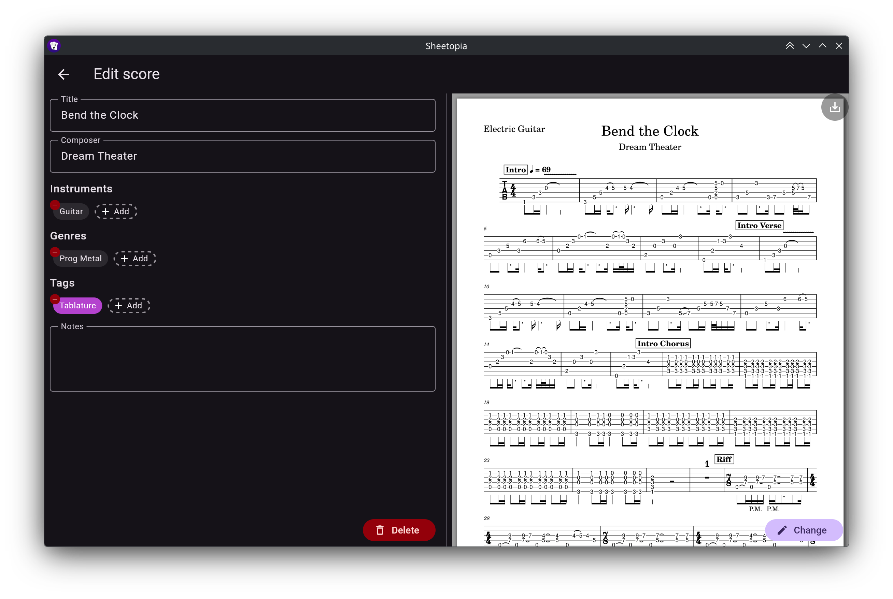
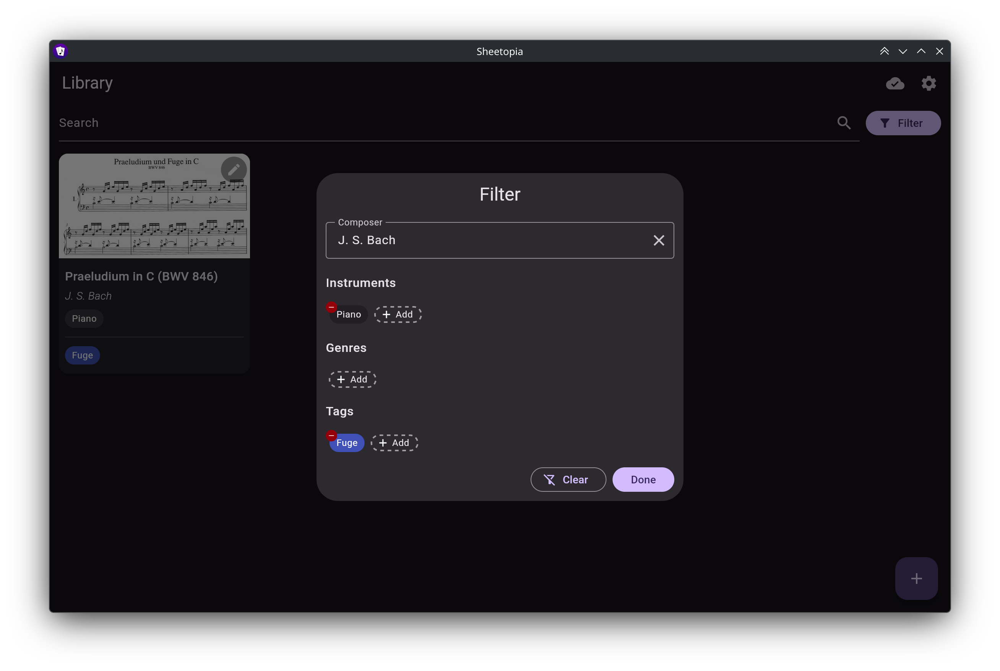

# Sheetopia

Sheetopia is a cross-platform local-first sheet music app with optional [self-hosted sync](https://github.com/juho05/sheetopia-sync).

Available on: [Windows](#windows), [macOS](#macos), [Linux](#linux), [Android](#android)

*iOS/iPadOS* is supported aswell but there are no release builds available, because I do not have a paid *Apple Developer* account.

[Install](#install)

[Screenshots](#screenshots)

## Features

- [x] Import PDF files of your sheet music (scanned or digital)
- [x] Manage metadata such as:
  - Title
  - Composer
  - Instruments
  - Genres
  - Tags
  - Notes
- [x] Search/filter your sheet music
- [x] Full screen reading/play mode
- [x] Compatible with Bluetooth/USB foot switches
- [x] Turn pages using MIDI controllers
  - [x] Local/USB MIDI
  - [x] Bluetooth MIDI (incl. BLE)
  - [x] Network MIDI on iOS/macOS
- [x] [Sync your sheet music across your devices](https://github.com/juho05/sheetopia-sync)
- [x] Full offline support.
- [x] Modern UI with light/dark theme

## Install

Release builds are available on the [releases](https://github.com/juho05/sheetopia/releases/latest) page under *Assets*.

See below for installation instructions for your platform.

Visit [sheetopia-sync](https://github.com/juho05/sheetopia-sync#setup) to install the optional sync server.

### Windows

1. Download `Sheetopia-x.x.x-windows-x86-64.exe` from the *Assets* section of the [latest release](https://github.com/juho05/sheetopia/releases/latest).
2. Execute the downloaded file and follow the instructions of the installer.
    - If you are prompted that *Windows protected your PC* click *More info*, then *Run anyway*. 
      This warning appears because the installer is not signed and can safely be ignored.
3. Sheetopia should now be installed on your system.

### macOS

1. Download `Sheetopia-x.x.x-linux-x86-64.AppImage` from the *Assets* section of the [latest release](https://github.com/juho05/sheetopia/releases/latest).
2. Open the downloaded file.
3. Drag the `Sheetopia` icon to the `Applications` directory.
4. Open `Sheetopia` from the app launcher and click *Done* when macOS tells you it prevented Sheetopia from being opened.
5. Because Sheetopia is not signed, you'll need to allow it to be opened. To do that:
   1. Open system settings.
   2. Navigate to *Privacy & Security*.
   3. Scroll down until you see: *"Sheetopia" was blocked to protect your Mac*.
   4. Click *Open anyway* and confirm *Open anyway* in the confirmation dialog.
   5. Enter your macOS user password when prompted.
6. Sheetopia should now be installed on your system.

### Linux

1. Download `Sheetopia-x.x.x-linux-x86-64.AppImage` from the *Assets* section of the [latest release](https://github.com/juho05/sheetopia/releases/latest).
2. Execute the downloaded file (allow execution when prompted). On some systems it's necessary to
   manually make the file executable. You can do that by entering the following command in a terminal in
   in the directory of the downloaded file:
   ```shell
   # change to the exact name of the downloaded file
   chmod +x ./Sheetopia-x.x.x-linux-x86-64.AppImage
   ```
3. When prompted to integrate the AppImage, click *Yes*.
4. Sheetopia should now be installed on your system.

### Android

1. Download the correct APK file for your architecture (usually `arm64v8`) from the *Assets* section of the [latest release](https://github.com/juho05/sheetopia/releases/latest).
2. Open the downloaded file and allow your browser/file manager (depending on what you use to open the file) to install
   apps from unknown sources by clicking on *Settings* when prompted and enabling *Allow from this source*.
3. Click on *Install* when asked whether you want to install Sheetopia (you might have to open the APK file again).
4. Sheetopia should now be installed on your system.

## Screenshots






## License

Copyright (c) 2025-2026 Julian Hofmann (+ [Sheetopia contributors](https://github.com/juho05/sheetopia/contributors))

Source code files in this repository are subject to the terms of the Mozilla Public
License, v. 2.0, unless explicitly stated otherwise. If a copy of the MPL was not distributed with this
file, You can obtain one at https://mozilla.org/MPL/2.0/.