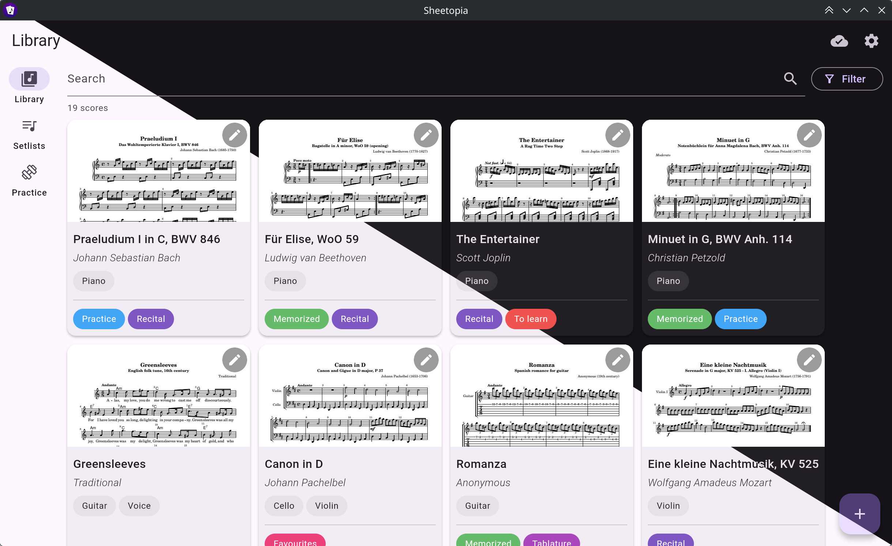
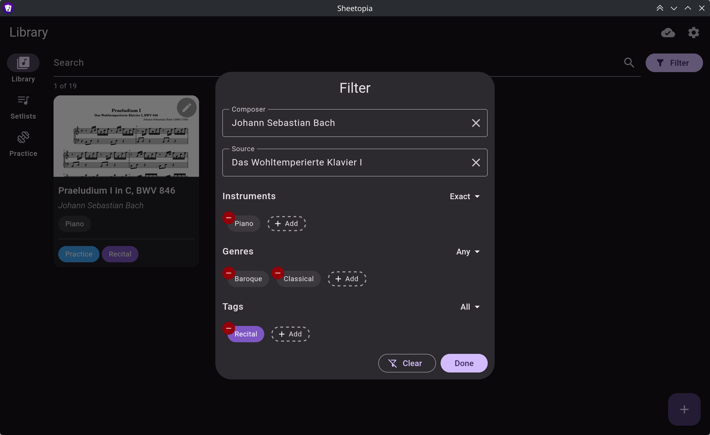
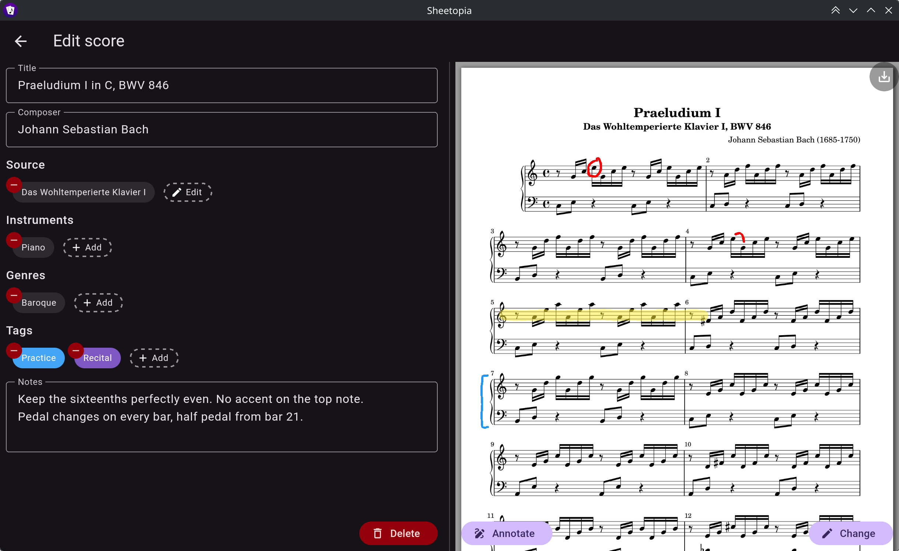
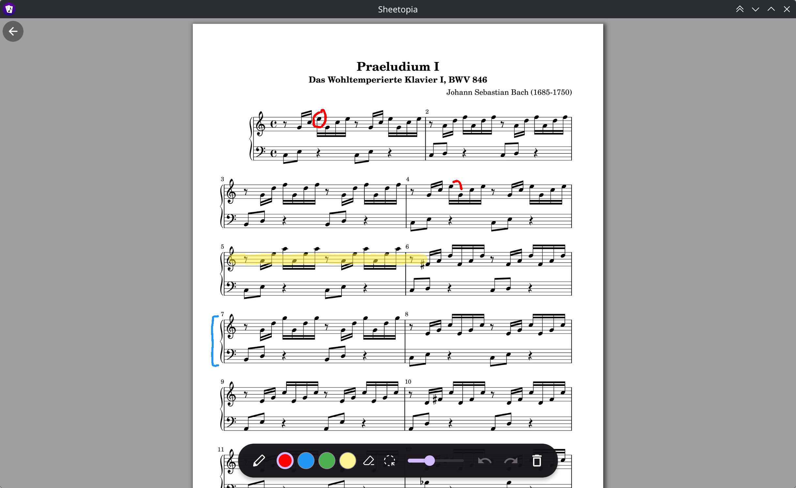
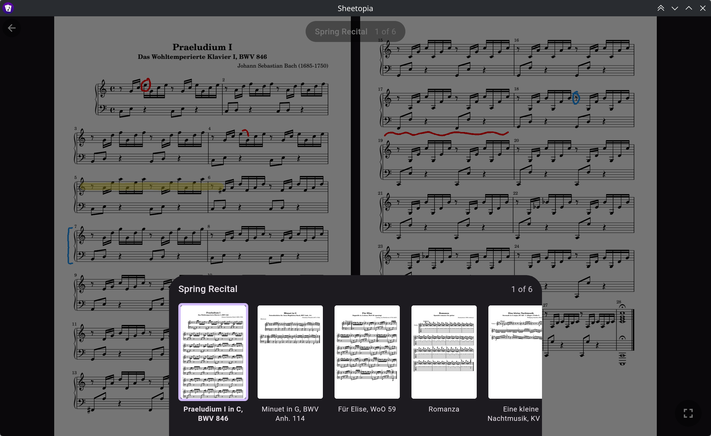
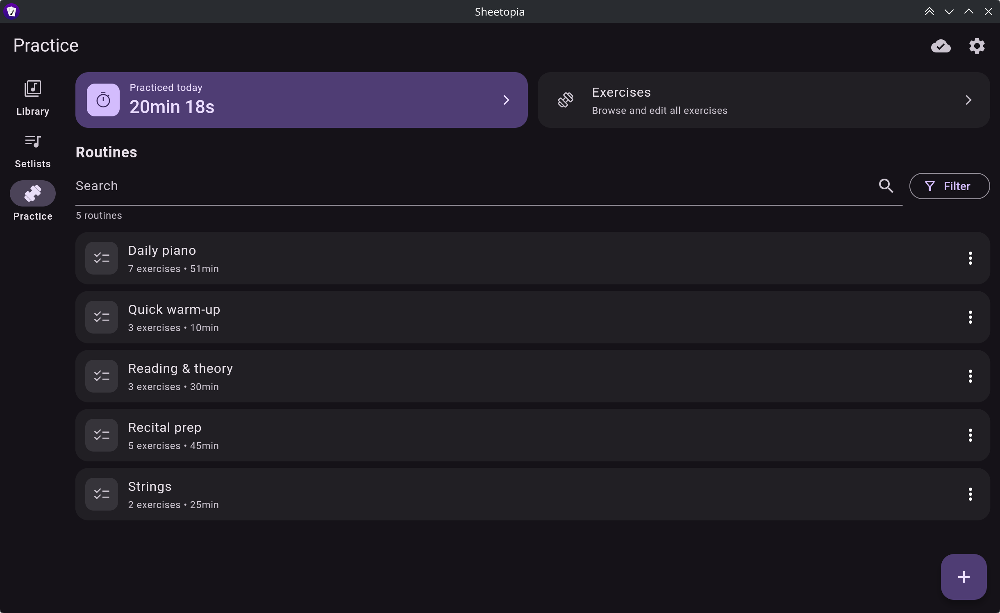
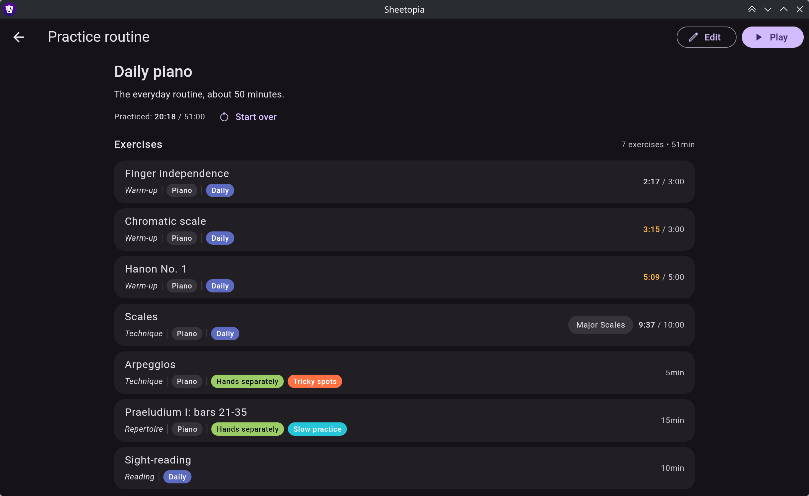
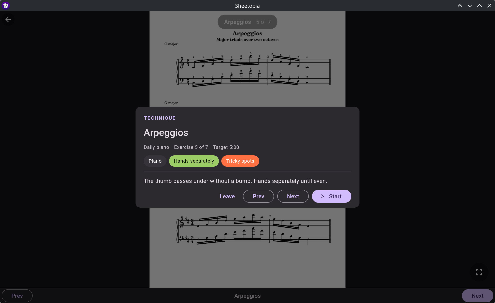
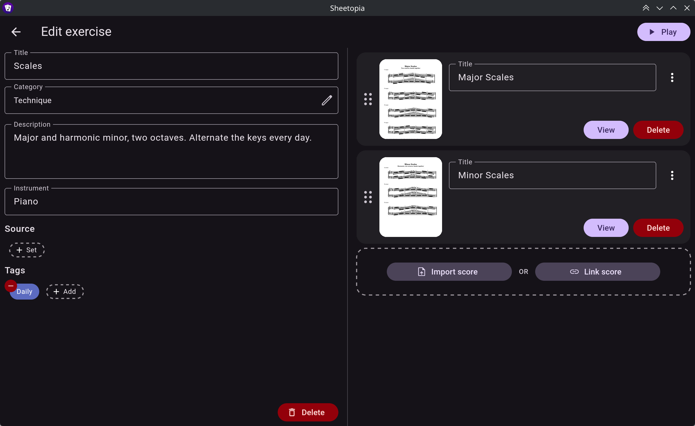

# Sheetopia

Sheetopia is a cross-platform local-first sheet music app with
optional [self-hosted sync](https://github.com/juho05/sheetopia-sync).

Available on: [Windows](#windows), [macOS](#macos), [Linux](#linux), [Android](#android)

iOS/iPadOS builds will soon be available via TestFlight.

[Install](#install)

[Screenshots](#screenshots)

## Features

- [x] Import PDF files of your sheet music (scanned or digital)
    - [x] Scan using device camera
- [x] Manage metadata such as:
    - Title
    - Composer
    - Instruments
    - Genres
    - Tags
    - Source
    - Notes
- [x] Search/filter your sheet music
- [x] Full screen reading/play mode
- [x] Annotations with stylus support
- [x] Setlists
- [x] Compatible with Bluetooth/USB foot switches
- [x] Turn pages using MIDI controllers
    - [x] Local/USB MIDI
    - [x] Bluetooth MIDI (incl. BLE)
- [x] [Sync your sheet music across your devices](https://github.com/juho05/sheetopia-sync)
- [x] Full offline support.
- [x] Practice management and tracking
    - [x] Exercises with categories, tags and other metadata
    - [x] Add/link multiple scores to exercises
    - [x] Build practice routines from exercises with target times
    - [x] Track practice sessions
- [x] Import/export your library
- [x] Modern UI with light/dark theme

## Install

Release builds are available on the [releases](https://github.com/juho05/sheetopia/releases/latest) page under *Assets*.

See below for installation instructions for your platform.

Visit [sheetopia-sync](https://github.com/juho05/sheetopia-sync#setup) to install the optional sync server.

### Windows

1. Download `Sheetopia-x.x.x-windows-x86-64.exe` from the *Assets* section of
   the [latest release](https://github.com/juho05/sheetopia/releases/latest).
2. Execute the downloaded file and follow the instructions of the installer.
    - If you are prompted that *Windows protected your PC* click *More info*, then *Run anyway*. This warning appears
      because the installer is not signed and can safely be ignored.
3. Sheetopia is now installed on your system.

### macOS

1. Download `Sheetopia-x.x.x-macOS-universal.dmg` from the *Assets* section of
   the [latest release](https://github.com/juho05/sheetopia/releases/latest).
2. Open the downloaded file.
3. Drag the `Sheetopia` icon to the `Applications` directory.
4. Sheetopia is now installed on your system.

### Linux

1. Download `Sheetopia-x.x.x-linux-x86-64.AppImage` from the *Assets* section of
   the [latest release](https://github.com/juho05/sheetopia/releases/latest).
2. Execute the downloaded file (allow execution when prompted). On some systems it's necessary to manually make the file
   executable. You can do that by entering the following command in a terminal in in the directory of the downloaded
   file:
   ```shell
   # change to the exact name of the downloaded file
   chmod +x ./Sheetopia-x.x.x-linux-x86-64.AppImage
   ```
3. When prompted to integrate the AppImage, click *Yes*.
4. Sheetopia is now installed on your system.

### Android

1. Download the correct APK file for your architecture (usually `arm64v8`) from the *Assets* section of
   the [latest release](https://github.com/juho05/sheetopia/releases/latest).
2. Open the downloaded file and allow your browser/file manager (depending on what you use to open the file) to install
   apps from unknown sources by clicking on *Settings* when prompted and enabling *Allow from this source*.
3. Click on *Install* when asked whether you want to install Sheetopia (you might have to open the APK file again).
4. Sheetopia is now installed on your system.

## Screenshots

<p align="center">
  <br>
  <em>library in light and dark theme</em>
</p>

<p align="center">
  <br>
  <em>filter library by metadata</em>
</p>

<p align="center">
  <br>
  <em>edit metadata</em>
</p>

<p align="center">
  <br>
  <em>annotate scores with stylus support</em>
</p>

<p align="center">
  <br>
  <em>create and play setlists</em>
</p>

<p align="center">
  <br>
  <em>the separate tab for practice</em>
</p>

<p align="center">
  <br>
  <em>build practice routines and track your practice time</em>
</p>

<p align="center">
  <br>
  <em>the UI for starting an exercise</em>
</p>

<p align="center">
  <br>
  <em>edit exercise metadata and add multiple scores</em>
</p>

## License

Copyright (c) 2025-2026 Julian Hofmann (+ [Sheetopia contributors](https://github.com/juho05/sheetopia/contributors))

Source code files in this repository are subject to the terms of the Mozilla Public License, v. 2.0, unless explicitly
stated otherwise. If a copy of the MPL was not distributed with this file, You can obtain one
at https://mozilla.org/MPL/2.0/.